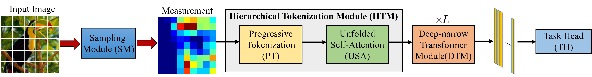
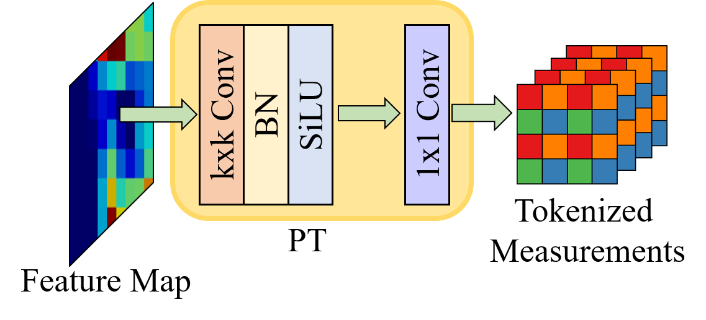
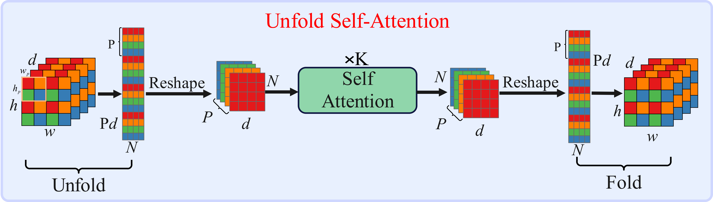

# 📖 HTHA-CL: An Efficient And Robust Compressed Learning Framework Using Hierarchical Tokenization With Hybrid Attention





## 🔧 Dependencies and Installation

- Python >= 3.8 (Recommend to use [Anaconda](https://www.anaconda.com/download/#linux) or [Miniconda](https://docs.conda.io/en/latest/miniconda.html))
- [PyTorch >= 1.12](https://pytorch.org/)
- timm >= 0.9.16
- OpenCV >= 4.8.0
- MMSegmentation >= 1.2.2 (For semantic segmentation task)
- At least two RTX3090 GPUs are required.

### Installation

1. Clone repo

    ```bash
    git clone https://github.com/acrlife/HTHA-CL.git
    cd HTHA-CL-main
    ```

2. Install dependent packages

    ```bash
    conda install pytorch=1.12.0 torchvision==0.13.0 cudatoolkit=11.3 -c pytorch -y
    pip install opencv-python
    pip install timm == 0.9.16     
    ```

## Training for Classification
1. Prepare the training data of [ImageNet1K](https://image-net.org/download-images.php)
2. Download the pre-trained checkpoints of our backbone on [ImageNet1K](https://pan.baidu.com/s/1C6W5rbP_Ad0qKD3KYOWOOQ?pwd=HTHA), 提取码: HTHA. 

#### Training on ImageNet with two GPUs(Change the --data and --transfer-model to your own, and modify the following commands in the same way.)
```bash
torchrun --nnodes=1 --nproc_per_node=2 train_on_imagenet.py --data '../imagenet' --model htha_14 --epochs 60 -b 80 -j 8 --transfer-learning True --transfer-model '../checkpoint/pretrained_weight.pth' --lr 1e-3 --warmup-epochs 5 --warmup-lr 1e-5 --min-lr 2e-4 --weight-decay 5e-4 --amp --img-size 384
```

#### Training on Cifar100 with two GPUs
```bash
python train_on_cifar.py --model htha_14 --dataset cifar100 --data ../data --lr 0.001 --b 128 --img-size 384 --rat 0.1 --transfer-model ../checkpoint/pretrained_weight.pth --num-gpu 2
```
#### Training on Cifar10 with two GPUs
```bash
python train_on_cifar.py --model htha_14 --dataset cifar10 --data ../data --lr 0.001 --b 128 --img-size 384 --rat 0.1 --transfer-model ../checkpoint/pretrained_weight.pth --num-gpu 2
```
#### If you want to train on one GPU, set '--num-gpu' to 1.

## Testing for Classification
You can download the pre-trained checkpoints from our model zoo.
### Testing on ImageNet with two GPUs
```bash

python val_imagenet.py --model htha_14 --data ../imagenet --img-size 384 -b 128 --rat 0.1 --eval_checkpoint ../checkpoint/imagenet1k@384_r10.pth --num-gpu 2
```

### Testing on Cifar10 with two GPUs
```bash

python val_cifar.py --model htha_14 --img-size 384 --dataset cifar10 --data ../data --b 128 --rat 0.10 --eval_checkpoint ../checkpoint/cifar10/cifar10_384_r0.1_97.75.pth --num-gpu 2
```
### Testing on Cifar100 with two GPUs
```bash

python val_cifar.py --img-size 384 --dataset cifar100 --data ../data --b 128 --rat 0.10 --eval_checkpoint ../checkpoint/cifar100/cifar100_384_r0.1_86.68.pth --num-gpu 2
```
#### If you want to test on one GPU, set '--num-gpu' to 1.

## Model Zoo
### Classification

| Mode        |                           Download link                     | 
| :------------------- | :--------------------------------------------: |
| Pre-trained Backbone        |                           [URL](https://pan.baidu.com/s/1C6W5rbP_Ad0qKD3KYOWOOQ?pwd=HTHA), 提取码: HTHA                     |  
| ImageNet classification (ratio={0.1, 0.05, 0.025, 0.01})       |                           [URL](https://pan.baidu.com/s/1gXnjhxRa1k0rrExO7XfMsw?pwd=HTHA),  提取码: HTHA                     |
| Cifar10 classification (ratio={0.25, 0.1, 0.018})     |                           [URL](https://pan.baidu.com/s/1mIbuqTcl4cy5itaMPbLB8A?pwd=HTHA), 提取码: HTHA                    |  
| Cifar100 classification (ratio={0.25, 0.1, 0.018})     |                           [URL](https://pan.baidu.com/s/1fSmiXN-j1qmxMXeBJaAnZA?pwd=HTHA), 提取码: HTHA                     |  
